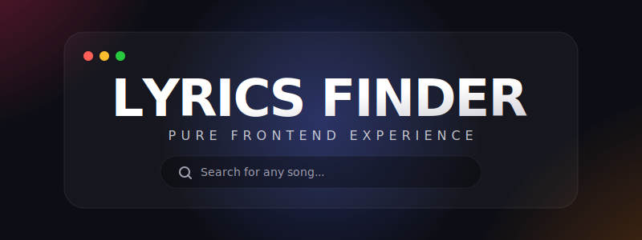

<div align="center">

  

  <br />
  <br />

  <p align="center">
    <b>A stunning, glassmorphism-inspired, frontend-only song lyrics finder.<br/> Never miss a beat.</b>
  </p>

  <p align="center">
    <a href="#sparkles-features">Features</a> •
    <a href="#rocket-quick-start">Quick Start</a> •
    <a href="#art-technologies-design">Technologies</a> •
    <a href="#electric_plug-api">API</a>
  </p>

  <div>
    
    
    
    
  </div>
</div>

<br/>

## :sparkles: Features

Designed with a focus on both aesthetics and functionality. 

| Feature | Description |
| :--- | :--- |
| **🔍 Precision Search** | Find lyrics accurately by providing the **song title** and optionally the **artist name**. Fallback search ensures you find the closest match. |
| **⏱️ Synced & 📝 Plain Lyrics** | Seamlessly toggle between time-synced lyrics (when available via API) and plain text lyrics. |
| **🌗 Modern Glassmorphism UI**| A beautifully designed dark theme with animated floating blobs, translucent glass panels, and modern typography (`Outfit` font). |
| **📋 1-Click Copy** | Instantly copy lyrics to your device's clipboard with smooth animated toast notifications. |
| **📱 Fully Responsive** | Fluid UI that adapts flawlessly across all devices: from ultra-wide monitors to mobile screens. |
| **⚡ Zero Backend** | 100% frontend. Absolutely no build steps, node_modules, or server setup required. Just pure web magic. |

<br/>

## :art: Technologies & Design

The application prioritizes performance and visual fidelity, using raw web primitives rather than heavy frameworks:

- **Structure:** Semantic HTML5
- **Styling:** CSS3 Variables, modern properties (like `backdrop-filter` for glassmorphism), CSS Keyframe Animations.
- **Logic:** Vanilla JavaScript (ES6+), `async/await`, Fetch API.
- **Assets:** [FontAwesome 6](https://fontawesome.com/) for icons, [Google Fonts (Outfit)](https://fonts.google.com/specimen/Outfit) for a premium typography feel.

<br/>

## :rocket: Quick Start

Because this project is entirely frontend, launching it takes less than 5 seconds!

### Option 1: Run Locally
1. **Clone** this repository or download the `.zip`.
   ```bash
   git clone https://github.com/yourusername/lrcfinder.git
   ```
2. **Navigate** to the folder.
3. double-click **`index.html`** to open it in your browser.

### Option 2: Live Server
If you use VS Code, you can use the **Live Server** extension:
1. Open the project folder in VS Code.
2. Right-click on `index.html`.
3. Select **"Open with Live Server"**.

<br/>

## :electric_plug: API Integration

This application searches the universe of music via the powerful, open-source **[LRCLIB API](https://lrclib.net/)**.

- **`/api/get`** - Used for instantaneous, exact matches when both the `artist` and `track` parameters are perfectly aligned.
- **`/api/search`** - A robust fallback search algorithm that sifts through results to find the closest matching track with lyrics.

<br/>

## :handshake: Contributing

Found a bug or have an idea for a stunning new animation? Contributions, issues, and feature requests are welcome! Feel free to check the [issues page](../../issues).

---

<p align="center">
  Crafted with ❤️ and 🎵 using pure Vanilla JavaScript
</p>
